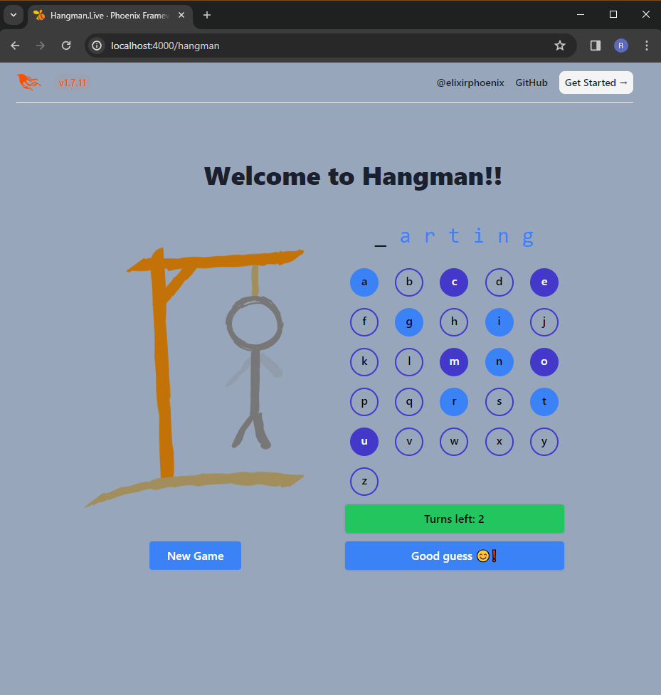

# Hangman Live

_Hangman Game_ built with LiveView.

##### Based on the course [Elixir for Programmers](https://codestool.coding-gnome.com/courses/elixir-for-programmers) by Dave Thomas.

## Usage

To use `Hangman Live` locally, clone and compile it:

  - `git clone https://github.com/RaymondLoranger/hangman_live`
  - `cd hangman_live`
  - `mix deps.get`
  - `mix phx.server`

Now you can visit [`localhost:4000/hangman`](http://localhost:4000/hangman)
from your browser.

## Game in progress

## 